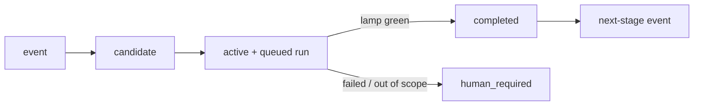

# Loop Hybrid 2

> 中文說明（安裝、使用、流程圖）：[README.md](README.md)

Loop Hybrid 2 (LH2) is a deterministic goal-loop engine. It turns a ratified goal
into audited runs: every step is replayable, every verdict comes from a
committed check, and anything irreversible stays in human hands.

## Loop at a glance



## See it close itself (60 seconds)

No credentials, no external services — after cloning:

```bash
npm test                                          # every deterministic gate, incl. the full loop
python3 -B lh_runtime/intent_derivation_canary.py # intent→candidate→admission→dispatch→completed
python3 -B lh_runtime/goal_loop_canary.py         # full loop: seed→run→verify→next stage→restart
```

A canary only counts when it prints `{"status": "pass", ...}` — the engine does
not accept a model's word as proof. Everything runs offline in tempdirs, so any
clone can reproduce the same closed loop.

## Core concepts

- **Durable SQLite goal/run store** — goals, runs, attempts, and usage records
  survive restarts; nothing lives only in memory.
- **Serial single-holder worker** — one worker holds the loop at a time, so
  state transitions stay deterministic and auditable.
- **Disposable-clone executors** — each attempt runs in a throwaway workspace
  clone; the source tree is never mutated in place.
- **Committed canaries as acceptance authority** — acceptance is a check script
  committed in the repo (`gate-pack/`, `lh_runtime/*_canary.py`), not a model's
  say-so.
- **Promotion is always human-owned** — push, merge, publish, and release are
  never performed by the loop.
- **Multi-model layering** — the optional `models` contract field routes
  execution to a coding CLI and judging to a separate reasoning CLI.

## Repository layout

- `lh_runtime/` — the engine: goal store, run store, worker, driver,
  admission, budget, plus its canaries.
- `gate-pack/` — the deterministic gate pack run by `npm test`
  (boundary seal, ceremony grader, quota, improvement, and more).
- `hooks/` — optional git hooks (e.g. a pre-commit ceremony check).
- `.github/workflows/ci.yml` — CI: gate pack, lint, boundary seal, diff hygiene.

## Quickstart

Requirements: Python 3.12+ and Node.js (npm scripts are thin wrappers around
shell and Python).

```sh
npm test       # run every deterministic gate; all must pass
npm run lint   # shell syntax + in-memory Python compile check
```

## Project runtime contract

Each adopting project describes itself with a runtime contract; see
[`project_runtime_contract.example.json`](project_runtime_contract.example.json)
for an annotated example.

## Live smoke

The optional GitHub CI-conclusion live smoke
(`lh_runtime/b7_live_smoke_canary.py --execute`) reads its target owner from the
`LH_LIVE_SMOKE_OWNER` environment variable. When it is unset, the live path
skips with a recorded known gap; the offline `--dry-run` gate is unaffected.

## License

[MIT](LICENSE) — copyright 2026 Loop Hybrid contributors.

## Security model

- **Isolation is the disposable clone.** Executor presets run agent CLIs in
  full-auto mode (bypass flags) by design; the boundary is the throwaway
  clone, never your working tree. Keep untrusted content out of the loop.
- **Promotion is always human-owned** — the loop stops at evidence.
- **Credentials are environment variables only**, and missing ones raise.
- **Acceptance is mechanical** (committed canaries), never the model's word.
- **Out-of-scope diffs are rejected** and route to `human_required`.
