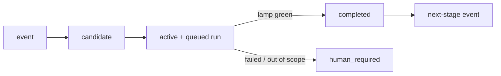

# Loop Hybrid 2

> 中文說明（安裝、使用、流程圖）：[README.md](README.md)

Loop Hybrid 2 (LH2) is a deterministic goal-loop engine. It turns a ratified goal
into audited runs: every step is replayable, every verdict comes from a
committed check, and actions outside the ratified Goal envelope return to the
project or human.

## Loop at a glance


```mermaid
flowchart LR
    E["event"] --> C[candidate] --> A[active + queued run]
    A -->|lamp green| D[completed]
    A -->|failed / out of scope| H[human_required]
    D --> N[next-stage event]
```

## See it close itself (60 seconds)

No credentials, no external services — after cloning:

```bash
npm test                                          # every deterministic gate, incl. the full loop
python3 -B lh_runtime/intent_derivation_canary.py # intent→candidate→admission→dispatch→completed
python3 -B lh_runtime/goal_loop_canary.py         # full loop: seed→run→verify→next stage→restart
```

A canary only counts when it prints `{"status": "pass", ...}` — the engine does
not accept a model's word as proof. Everything runs offline in tempdirs, so any
clone can reproduce the same closed loop.

## Core concepts

- **Durable SQLite goal/run store** — goals, runs, attempts, and usage records
  survive restarts; nothing lives only in memory.
- **Serial single-holder worker** — one worker holds the loop at a time, so
  state transitions stay deterministic and auditable.
- **Disposable-clone executors** — each attempt runs in a throwaway workspace
  clone; the source tree is never mutated in place.
- **Committed canaries as acceptance authority** — acceptance is a check script
  committed in the repo (`gate-pack/`, `lh_runtime/*_canary.py`), not a model's
  say-so.
- **Goal-scoped authority** — the project/human ratifies the Goal, authority
  envelope, stop conditions, and terminal acceptance. Inside it, the loop may
  commit, push an `lh/*` branch, or conditionally merge when the committed gate
  passes. Publication, release, and terminal product acceptance remain
  project/human-owned.
- **Multi-model layering** — the optional `models` contract field routes
  execution to a coding CLI and judging to a separate reasoning CLI.

## Repository layout

- `lh_runtime/` — the engine: goal store, run store, worker, driver,
  admission, budget, plus its canaries.
- `gate-pack/` — the deterministic gate pack run by `npm test`
  (boundary seal, ceremony grader, quota, improvement, and more).
- `hooks/` — optional git hooks (e.g. a pre-commit ceremony check).
- `governance/` — checks registry and decision-seal data read by the gates.
- `tests/` — shared offline fixtures imported by the canaries (native delivery
  run, fence fixture); they never start a provider.
- `tools/portable_runtime_contract.py` — static check that the portable core
  stays free of host-specific imports and fixed paths.
- `.github/workflows/ci.yml` — CI: gate pack, lint, boundary seal, diff hygiene.

## Engine additions in this version

- **Parallel scheduler + work-unit store** (`parallel_scheduler.py`,
  `work_unit_store.py`, `plan_node_controller.py`) — independent work units run
  in isolated workspaces when dependencies and write sets allow; completion
  integrates in the approved order.
- **Delivery contract and completion** (`delivery_contract.py`,
  `work_unit_completion.py`, `source_result.py`) — one sealed contract engine
  shared by planning, execution, and verification.
- **Verifier protocol** (`verifier_protocol.py`, `verifier_normalizer.py`) —
  verifier results are normalized and bound to the attempt before they count.
- **Execution fences** (`execution_fence*.py`) — an optional preventive fence
  around agent CLIs (bubblewrap on Linux). It requires an egress policy file
  (`LH_EGRESS_POLICY`); without one the fence refuses to start rather than run
  unfenced.
- **Platform ports** (`platform_ports.py`, `host_ports.py`, `instance_config.py`,
  `lifecycle.py`) — host-specific behavior (locks, paths, process control) sits
  behind ports, so the core carries no fixed host paths.
- **Provider registry and input binding** (`provider_registry.py`,
  `provider_input_binding.py`, `runner_adapter.py`) — capability-based routing;
  project nodes never name a provider or model.

## Platform support

| Platform | Status |
|---|---|
| Linux | Reference platform. CI (`ubuntu-latest`) runs every gate. |
| Windows (native Python 3.12 + Git for Windows `sh`) | Partial. 73–74 of 87 gates pass. 13 always fail because they rely on POSIX-only behavior: executable-bit fake CLIs (4), the bubblewrap fences including the local provider sandbox (4), POSIX signals and process-holder semantics (2), and POSIX path or platform defaults (3). 1 more (run verdict) is timing-dependent: its fixed 0.25 s budget is sometimes exceeded by Windows process start-up. |
| macOS | Not tested. |

No Orca app, VS Code, or WSL is required. Orca is one optional execution-host
adapter; the default executors are local coding CLIs in disposable clones.

## Sandboxed provider runs without Orca (Linux)

The `local` executor starts the provider CLI (Codex today) itself, inside a
bubblewrap sandbox signed into each attempt's launch descriptor:

- read-only system and provider directories; only the disposable clone is
  writable; `/tmp` is a fresh tmpfs; the provider home is exposed read-only;
- new user/pid/ipc/uts namespaces, nested user namespaces disabled;
- a provider seccomp table (mount, namespace, tracing, module, BPF and
  keyring syscalls return `EPERM`); a cleared environment with a fence-owned
  `PATH`;
- the provider and bubblewrap binaries are pinned by digest at prepare time
  and re-checked at launch; each descriptor admits exactly one launch; a
  timeout kills the whole sandboxed process group.

Network stays the host's, because the provider must reach its API. Only the
provider argv is checked against the policy, and the receipt says so
(`host_network_policy_preflight`) instead of claiming network isolation.

Setup:

```sh
python3 -B lh_runtime/instance_config.py init --config ~/.config/loop-hybrid/instance.json
export LH_EXECUTION_FENCE_BACKEND=linux-bubblewrap-seccomp   # bubblewrap 0.9.0 + libseccomp
export LH_EGRESS_POLICY=<state root>/egress-policy.json       # generated by init
export LH_LOCAL_PROVIDER_AGENT=codex                          # or pass a provider_binding
python3 -B lh_runtime/goal_loop_run.py --contract project_runtime_contract.json --executor local --execute
```

On Linux, `init` pins bubblewrap and writes a `provider_sandbox_profile` into
the generated policy; it pins Orca only when an Orca binary exists. A
`provider_binding` (runner, base_url, model) is supported for Codex; its
per-invocation config flags must be allowed by the provider's policy rules.
Windows and macOS refuse this executor (`local_provider_unsupported`).

## Quickstart

Requirements: Python 3.12+ and Node.js (npm scripts are thin wrappers around
shell and Python).

```sh
npm test       # run every deterministic gate; all must pass
npm run lint   # shell syntax + in-memory Python compile check
```

## Project runtime contract

Each adopting project describes itself with a runtime contract; see
[`project_runtime_contract.example.json`](project_runtime_contract.example.json)
for an annotated example.

## Live smoke

The optional GitHub CI-conclusion live smoke
(`lh_runtime/b7_live_smoke_canary.py --execute`) reads its target owner from the
`LH_LIVE_SMOKE_OWNER` environment variable. When it is unset, the live path
skips with a recorded known gap; the offline `--dry-run` gate is unaffected.


## Operator quickstart: bind your own project

End-to-end, offline-verifiable up to step C:

1. **Write a campaign** — each `campaign.stages[]` entry is one bounded unit: `goal`
   (must_have/must_not), `allowed_paths` (out-of-scope diffs go value-RED),
   `acceptance_lamp`, `max_attempts`, `next_stage_id` (multi-stage auto-advance).
   Lamp rules: red-on-base (green-on-base means the work is already done and the
   precheck completes it for $0); deterministic and environment-independent;
   green must be positive proof of work, not absence of errors; verifier failures
   must exit nonzero.
2. **Issue a goal** — `python3 -B lh_runtime/command_ingress.py --goal-store <dir>
   --source operator --event-type manual_intent --event-id cmd-1 --payload
   '{"campaign_id":"example-campaign","stage_id":"stage-1","intent":"..."}'`
   (or let `standing_intents` emit one daily).
3. **Run the driver** — `python3 -B lh_runtime/goal_loop_run.py --contract
   project_runtime_contract.json --execute --max-cycles 12 --idle-limit 2`.
   Chain: intent → admission → disposable-clone execution → lamp + value gate →
   receipt → next stage. A cron/systemd timer calling the same bounded command
   makes it resident; every invocation is restart-safe.
4. **Read results** — `platform_status.json` (state, cost, heartbeat/staleness),
   `runs/artifacts/<run_id>/<attempt>/` (receipt, diff, verifier output, usage),
   and the read-only MCP server.
5. **Draft-PR mode** — declare `external_verdict` on the stage plus the
   `external_verdict.adapter` (github_pr): the engine pushes the diff to an `lh/*`
   branch, opens a **draft PR** with the evidence chain in the body, and resumes on
   the GitHub CI conclusion. Use a fine-grained PAT (single repo; Contents RW,
   Pull requests RW, Actions read) via `LH_GITHUB_TOKEN`. The default stops at a
   draft PR. Conditional merge requires an explicit `auto_merge` grant in the
   Project Runtime Contract and a passing committed merge gate; publication,
   release, and terminal product acceptance are not implied.

## License

[MIT](LICENSE) — copyright 2026 Loop Hybrid contributors.

## Security model

- **Isolation is the disposable clone.** Executor presets run agent CLIs in
  full-auto mode (bypass flags) by design; the boundary is the throwaway
  clone, never your working tree. Keep untrusted content out of the loop.
- **Authority is goal-scoped** — commit, `lh/*` push, and conditional merge
  require an explicit contract grant and passing committed gates. Publication,
  release, and terminal product acceptance remain project/human-owned.
- **Credentials are environment variables only**, and missing ones raise.
- **Acceptance is mechanical** (committed canaries), never the model's word.
- **Out-of-scope diffs are rejected** and route to `human_required`.
