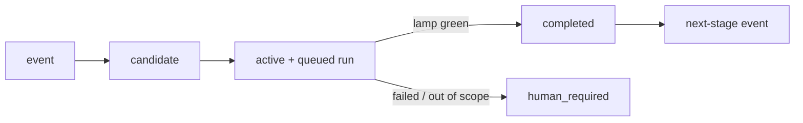

# Loop Hybrid 2

> 中文說明（安裝、使用、流程圖）：[README.md](README.md)

Loop Hybrid 2 (LH2) is a deterministic goal-loop engine. It turns a ratified goal
into audited runs: every step is replayable, every verdict comes from a
committed check, and actions outside the ratified Goal envelope return to the
project or human.

The engine needs only Python and git. It is not tied to any model vendor,
coding CLI, IDE, terminal host, hosting service, or operating-system service:
every command it runs is one you declare in the contract.

## Loop at a glance


```mermaid
flowchart LR
    E["event"] --> C[candidate] --> A[active + queued run]
    A -->|lamp green| D[completed]
    A -->|failed / out of scope| H[human_required]
    D --> N[next-stage event]
```

## See it close itself (60 seconds)

No credentials, no external services — after cloning:

```bash
npm test                                          # every deterministic gate, incl. the full loop
python3 -B lh_runtime/intent_derivation_canary.py # intent→candidate→admission→dispatch→completed
python3 -B lh_runtime/goal_loop_canary.py         # full loop: seed→run→verify→next stage→restart
```

A canary only counts when it prints `{"status": "pass", ...}` — the engine does
not accept a model's word as proof. Everything runs offline in tempdirs, so any
clone can reproduce the same closed loop.

## Core concepts

- **Durable SQLite goal/run store** — goals, runs, attempts, and usage records
  survive restarts; nothing lives only in memory.
- **Serial single-holder worker** — one worker holds the loop at a time, so
  state transitions stay deterministic and auditable.
- **Disposable-clone executors** — each attempt runs in a throwaway workspace
  clone; the source tree is never mutated in place.
- **Committed canaries as acceptance authority** — acceptance is a check script
  committed in the repo (`gate-pack/`, `lh_runtime/*_canary.py`), not a model's
  say-so.
- **Goal-scoped authority** — the project/human ratifies the Goal, authority
  envelope, stop conditions, and terminal acceptance. Inside it, the engine
  runs, verifies, and records. Effects outside the workspace (push, merge,
  publish) go only through an external action port you inject; the engine ships
  no implementation.
- **Declared executors** — the contract's `executors` block declares every
  command the engine may run (an absolute-path argv); `models` names only
  declared entries. The engine never searches `PATH` for a provider.
- **Multi-model layering** — `models.execute` and `models.judge` can name
  different declarations; costs use the `pricing` you declare.

## Repository layout

- `lh_runtime/` — the engine: goal store, run store, worker, driver,
  admission, budget, plus its canaries.
- `gate-pack/` — the deterministic gate pack run by `npm test`
  (boundary seal, ceremony grader, design grill, falsifier, and more).
- `hooks/` — optional git hooks (e.g. a pre-commit ceremony check).
- `tests/` — shared offline fixtures imported by the canaries (native delivery
  run, fence fixture); they never start a provider.
- `tools/portable_runtime_contract.py` — static check that the portable core
  stays free of host-specific imports and fixed paths.
- `.github/workflows/ci.yml` — CI for this repository: gate pack, lint,
  boundary seal, diff hygiene.

## Engine additions in this version

- **Parallel scheduler + work-unit store** (`parallel_scheduler.py`,
  `work_unit_store.py`, `plan_node_controller.py`) — independent work units run
  in isolated workspaces when dependencies and write sets allow; completion
  integrates in the approved order.
- **Delivery contract and completion** (`delivery_contract.py`,
  `work_unit_completion.py`, `source_result.py`) — one sealed contract engine
  shared by planning, execution, and verification.
- **Verifier protocol** (`verifier_protocol.py`, `verifier_normalizer.py`) —
  verifier results are normalized and bound to the attempt before they count.
- **Candidate review v2** (`delivery_contract.py`) — a delivery contract may add
  `candidate_review` (a digest-pinned spec, requirements, and caller context).
  The independent verifier must then return a closed review bound to this
  candidate; the engine derives the verdict from its findings, seals the raw
  bytes, and re-verifies them on readback. Exit 0 without a review fails. On
  the work-unit path the related checks run first, a red review's findings go
  back to the next attempt within the attempt budget, and non-blocking
  suggestions are only recorded in discovery, never turned into work.
- **Normal successor** (`task_area.py`) — once a reviewed task's integrated
  receipt chain re-verifies, its approved successor is released by rule
  without a Planner call; a red result, an unsettled recovery request, and
  legacy tasks still go to the existing Planner port.
- **Declared executors** (`cli_agent_executor.py`) — an executor declaration is
  closed data, not code; an undeclared name is refused.
- **Execution fence port** (`execution_fence.py`, `execution_fence_local.py`) —
  every launch first prepares a single-use, digest-bound launch descriptor. The
  bundled `local-process` backend owns the process group, deadline, and output
  limit, and its receipt states that nothing was contained; a containment
  backend is a port you supply. With no backend selected the port is disabled
  and the run stops at `human_required` instead of running unfenced.
- **Platform ports** (`platform_ports.py`, `host_ports.py`, `instance_config.py`,
  `lifecycle.py`) — host-specific behavior (locks, paths, process control) sits
  behind ports, so the core carries no fixed host paths.
- **Provider registry and input binding** (`provider_registry.py`,
  `provider_input_binding.py`, `runner_adapter.py`) — capability-based routing;
  project nodes never name a provider or model.
- **Decision registry** (`gate-pack/decision_registry/`, a tool for target
  repositories) — a decision is registered before the work, with acceptance
  probes and the paths it may touch; git is read commit by commit for guarded
  changes that name no registered decision; the outcome is re-derived by
  running the probes, never stored as done. `red-proof` records that each
  probe ran and failed at the exam commit, bound to the full sha; a policy can
  require that proof (or a reasoned exemption) for every probe.
- **Progress receipts and verifier queue** (`gate-pack/progress_receipts/`, a
  tool for target repositories) — a requester names only a check id; the
  verifier runs it in a snapshot pinned to HEAD and writes a hash-chained
  receipt, so progress without a receipt is not progress. Verification,
  acceptance, and promotion are recorded separately and in order; whether the
  two roles really are different principals is measured and reported.
- **Advancement verdict** (`gate-pack/advancement/`, a tool for target
  repositories) — the assignment fixes each criterion's baseline and closing
  receipts before judging; only red-to-green advances, so an already-green
  check or a check the worker chose does not count.
- **Independent retry verifier** (`gate-pack/retry_verifier/`) — a separate
  implementation that imports no engine module; it reads the work-unit store
  read-only and the executor's digest-bound receipts, and checks that the
  retry chain and launch budget agree.
- **Clone push boundary** (`controller.py`) — every remote of the disposable
  clone is sealed for push and a refusing `pre-push` hook is installed; the
  source repository's refs are compared around the executor, and a moved ref
  sends the attempt to `human_required`.
- **Open questions** (`open_questions.py`) — the snapshot's `open_questions`
  gives every `human_required` goal and event a kind, reason, and waiting time,
  and marks long-waiting ones `quiet`.
- **Retention** (`retention.py`) — plans by default (`lh-retention-plan/v1`)
  and removes only with `--apply`. It removes engine scratch (verifier
  snapshots, launch scratch, failed-check diagnostics, recovery copies, review
  proofs) only when superseded and unreferenced. Anything cited by the store or
  JSON evidence, within the grace period, the newest of its kind, a repository
  root, or any symlink or junction is kept with its reason; nothing outside the
  store root is touched.
- **Status trust** (`status_lamp.py`, `status_snapshot.py`) — the heartbeat and
  snapshot carry `code_identity`, which reports stale when the engine on disk
  changed but the driver was not restarted (report only, no automatic
  restart). The snapshot's `lamp` is the one health verdict, produced by a pure
  function from fixed rules, with the rules that fired.
- **Fleet** (`fleet.py`) — on each wake-up from an external scheduler, every
  `enabled` project in the registry (`lh-fleet-registry/v1`) runs one bounded
  `goal_loop_run` session with its own contract, stores, lock, and receipts. A
  failing project does not block the others, `paused` projects are not woken,
  and a project held elsewhere reports `not_holder`.
- **Onboarding** (`onboarding.py`) — `init` writes contract and acceptance
  lamp templates (never overwriting a file); `validate` reads files and git
  objects only and reports shape errors and drift (for example a verifier
  inside `allowed_paths` or an executor that is not an absolute path);
  `pilot` clones the target into a scratch directory and drives one full run
  to verified with a declared stand-in executor through the real entry
  points, leaving the target repository unchanged.
- **Failure router** (`failure_router.py`) — after a failure, one closed code
  table decides who does what next, with no model call and a recomputable
  receipt. Only ten owner actions need a human; an unknown code routes to the
  router table itself, and a third failure in the same place routes to a
  read-only audit. For now it is a projection: open questions flag items a
  machine could handle, and the execution flow is unchanged.
- **Plan shape check** (`plan_shape.py`) — a plan that declares
  `lh-sealed-plan/v1` is checked by the engine against a fixed list (cycles,
  duplicates, placeholders, unknown dependencies and dispatchable nodes,
  path overlap and dependencies inside a parallel group) before any verifier
  sees it; a defect is refused with its code and the verifier is not called.
- **Planner recovery exam** (`planner_recovery_canary.py`) — checks the plan
  and verdict rules one by one; on the campaign path a reviewed plan always
  waits for authority (never applied, attempt ceilings never replenished),
  a failed role is not retried, and a restart does not call a role twice.
- **Production-root guard** (`platform_ports.py`) — no task or test state or
  scratch directory may sit inside the production roots the engine derives
  from its platform path rules. Task scratch is now named
  `LH_TASK_STATE_ROOT` / `LH_TASK_TMP_ROOT`; setting an old name is refused
  with the new name in the error.
- **Canary inventory** (`canary_inventory_canary.py`) — every canary in
  `lh_runtime/` must be run by `verify.sh` or listed in a justified
  exemption table, so no exam rots quietly because nobody runs it.
- **Work-unit recovery lifecycle exam** (`work_unit_recovery_canary.py`) —
  on Runs driven through the real completion flow: request identity, a
  per-Run call budget, revalidation and the state each action lands in,
  and a read-only audit required after three failures.
- **Native recovery binding exam** (`native_recovery_binding_canary.py`) —
  builds the whole sealed chain from real files (contract, capability
  contract, provider registry, host contract, bootstrap authority, fence,
  dispatch); the sound chain resolves and every single change is refused
  for its own reason.
- **Isolated campaign recovery end-to-end exam** (`campaign_recovery_e2e_canary.py`)
  — every input is built in a temporary root, and the production entry runs
  in-process: real failures, stop line, request, stand-in roles through the
  fence, waiting for authority; no scheduler entry or host environment.
- **WorkspacePort** (`workspace_port.py`) — how the disposable workspace is
  made is replaceable (the default is still `git clone --no-local`). Any
  backend must pass `check_backend`: pushes and branches never reach the
  source, damaging the workspace's objects never damages the source, and a
  nested target runs from the same subtree; the controller refuses a
  workspace outside its root.
- **Fence backend conformance** (`gate-pack/fence_conformance/`, a tool for
  backend authors) — measures a backend's isolation claims: writes and reads
  outside the allowed roots, loopback egress, the caller's environment, the
  deadline, the output limit and started notifications; a claim that
  measurement contradicts is RED.
- **Contract seal** (`gate-pack/contract_seal/`, usable in any target repo) —
  `docs/contracts/seal.json` holds a digest per contract, and the scope comes
  from the repository, not from the seal; an edit without a reseal, a deleted
  or added contract, or a seal that shrinks turns it red. A reseal records who
  resealed and why.
- **Verifier readiness** (`controller.py`) — before an attempt begins, the
  controller checks that the acceptance lamp can be launched; if not, the tick
  returns `waiting_for_verifier`, spends no attempt and calls no model, and the
  next tick looks again. A launch that fails after the attempt began ends in
  `human_required` with a typed `verifier_unavailable` reason, never an
  exception.
- **Regression watch** (`regression_watch.py`, opt-in per contract) — re-runs
  the acceptance lamps of completed goals in a disposable workspace at the
  source HEAD, bounded per pass and by an interval; a red lamp raises one
  `regression_detected` question for the owner and never reopens the goal or
  creates a run; a lamp that cannot run is unknown.

## Platform support

| Platform | Status |
|---|---|
| Linux | Reference platform. CI (`ubuntu-latest`) runs every gate. |
| Windows (native Python 3.12 + Git for Windows `sh`) | Supported. All 112 gates pass; CI runs the full `gate-pack/verify.sh` on `windows-latest` (set `PYTHONUTF8=1`). Graceful stop uses `CTRL_BREAK_EVENT` (SIGBREAK) on Windows, and a file counts as executable by its `PATHEXT` suffix. One `lh-judge-wiring` item needs the symlink privilege: on a host without it (no Developer Mode, not elevated) that item fails explicitly with `symlink_privilege_required`; it is never skipped. Without `PYTHONUTF8=1`, `ceremony` can fail on a non-UTF-8 console (for example cp950) when it cannot decode non-ASCII commit messages. |
| macOS | Not tested. |

## Declaring executors

Every model command the engine runs must be declared in the contract's
`executors` block:

```json
"executors": {
  "coder": {"argv": ["/absolute/path/to/your-coding-agent", "{prompt}"], "usage": "none"},
  "judge": {"argv": ["/absolute/path/to/your-reasoning-agent", "--model", "{model}", "{prompt}"],
            "usage": "lh-usage-line/v1"}
},
"models": {"execute": "coder", "judge": "judge", "judge_model": "your-model-id"}
```

- `argv[0]` must be an absolute path and `{prompt}` must appear exactly once.
  The engine never searches `PATH`, so whatever CLIs happen to be installed on
  the machine are never reached by accident.
- `{model}` and `{base_url}` are optional slots. A slot needs a value
  (`judge_model` or `models.execute_binding`) and a value needs a slot; anything
  else is refused.
- `usage` is one of two protocols: `none` (usage is recorded as unknown) or
  `lh-usage-line/v1`, where the executor prints
  `{"usage": {"input_tokens": 0, "output_tokens": 0, "cache_read_tokens": 0}}`
  as its last stdout line. The engine parses no vendor output format and never
  guesses a number.
- A nonzero exit fails the attempt.
- `pricing` (optional) declares per-model rates in USD per million tokens:
  `{"your-model-id": {"input": 1.0, "output": 4.0, "cache_read": 0.1}}`. An
  unpriced model's cost stays unknown; the engine ships no price table, and the
  daily cost caps use only the rates you declare.
- Without a contract, pass the same declarations with `--executors <file.json>`.

## Quickstart

Requirements: Python 3.12+, git, and Node.js (npm scripts are thin wrappers
around shell and Python).

```sh
npm test       # run every deterministic gate; all must pass
npm run lint   # shell syntax + in-memory Python compile check
```

To put a real coding agent to work, declare its absolute path under
`executors`; the engine requires no particular tool.

## Project runtime contract

Each adopting project describes itself with a runtime contract; see
[`project_runtime_contract.example.json`](project_runtime_contract.example.json)
for an annotated example. The quickest start is to let the engine write the
templates, check them, and try one run with a stand-in executor (no model is
called and your repository is not changed):

```bash
python3 -B lh_runtime/onboarding.py init /path/to/your-repo
python3 -B lh_runtime/onboarding.py validate /path/to/your-repo
python3 -B lh_runtime/onboarding.py pilot /path/to/your-repo \
  --executors stand-in.json --executor stand-in
```

The pilot reads the repository's committed content, so commit the acceptance
lamp first.

Every run needs a sealed delivery binding, and its executor, delivery checks,
and independent verifier all run through the execution fence:

- **Opt in** per stage with `"delivery": {"derive": "acceptance_lamp"}` (see the
  example). Loading the contract compiles a binding from that stage's own
  acceptance lamp; the planner is recorded as `operator-contract`, bound to the
  contract file's digest. Optional `"checks": [{"id": "...", "argv": [...]}]`
  name the delivery checks; the default is `git diff --cached --check`.
- **Execution**: with `--execute`, each command runs through the fence named by
  `LH_EXECUTION_FENCE_BACKEND`. `local-process` runs it inside the clone as an
  owned process group, kills the whole group on timeout, and records
  `kernel_containment: false` in the receipt — it does not isolate anything, and
  the safety boundary remains the disposable clone. For isolation, implement
  `ExecutionFencePort` and select your backend instead.
- **No backend selected**: no runner is installed and the run stops at
  `human_required`; the reason is in the run's `plan.delivery_command_runner`.
- A stage without `delivery` still stops at `planning_required`; the native-run
  binding (`planner_recovery`) is unaffected.

```sh
export LH_EXECUTION_FENCE_BACKEND=local-process
python3 -B lh_runtime/goal_loop_run.py --contract project_runtime_contract.json \
  --execute --max-cycles 12 --max-runtime-seconds 900
```

## Live smoke

`lh_runtime/live_smoke_canary.py` is the offline loop gate. With `--live
--executor <name> --executors <file.json>` (optionally `--pricing
<file.json>`), it runs the same chain once with a real declared executor. It
skips (exit 0) when the executor is not declared or its executable is missing,
so an absent provider never turns the smoke red. It is never part of `npm test`.

## Operator quickstart: bind your own project

End-to-end, offline-verifiable up to step C:

1. **Write a campaign** — each `campaign.stages[]` entry is one bounded unit: `goal`
   (must_have/must_not), `allowed_paths` (out-of-scope diffs go value-RED),
   `acceptance_lamp`, `max_attempts`, `next_stage_id` (multi-stage auto-advance).
   Lamp rules: red-on-base (green-on-base means the work is already done and the
   precheck completes it for $0); deterministic and environment-independent;
   green must be positive proof of work, not absence of errors; verifier failures
   must exit nonzero; the verifier must live outside `allowed_paths` (otherwise
   the agent could edit it green — an opted-in stage that breaks this is refused
   with `independent_verifier_in_write_scope`).
2. **Issue a goal** — `python3 -B lh_runtime/command_ingress.py --goal-store <dir>
   --source operator --event-type manual_intent --event-id cmd-1 --payload
   '{"campaign_id":"example-campaign","stage_id":"feature","intent":"..."}'`
   (or let `standing_intents` emit one daily).
3. **Run the driver** — `LH_EXECUTION_FENCE_BACKEND=local-process python3 -B
   lh_runtime/goal_loop_run.py --contract project_runtime_contract.json --execute
   --max-cycles 12 --idle-limit 2`.
   Chain: intent → admission → disposable-clone execution → lamp + value gate →
   receipt → next stage. Any external scheduler calling the same bounded command
   makes it resident; every invocation is restart-safe.
4. **Read results** — `platform_status.json` (state, cost, heartbeat/staleness),
   `runs/artifacts/<run_id>/<attempt>/` (receipt, diff, verifier output, usage),
   and the read-only MCP server.
5. **External effects and verdicts** — the engine ships no adapter for any
   external service. To act outside the workspace (push, review, merge,
   publish) or advance a run on an external conclusion, inject through the
   engine API: an external action port (`external_action_port.py`, deduplicated
   by `operation_key`; your adapter must read back an existing effect for the
   same key) and a verdict store with a conclusion source
   (`external_verdict.py`; only explicit `success` / `failure` count). A
   post-run effect (merge, publish, deploy) sent through `effect_guard.guarded_dispatch`
   first re-verifies that the current attempt's final delivery is GREEN, that
   its diff leaves the authority surface alone, and that the target still reads
   back as the reviewed one (again after any wait); a contract with candidate
   review v2 also needs an `lh-effect-grant/v1` bound to its contract digest. A
   prepared marker is recorded before sending, so a lost response is settled by
   readback only, never by sending again. Your target implements `readback`
   and an `op_key`-idempotent `perform`. A contract
   carrying an `external_verdict` block is refused, not silently ignored.
   Whether an external effect is allowed is the injecting project's call;
   publication, release, and terminal product acceptance stay project/human-owned.

## License

[MIT](LICENSE) — copyright 2026 Loop Hybrid contributors.

## Security model

- **Isolation is the disposable clone.** The bundled `local-process` fence
  bounds time, output, and the process group but contains nothing, and says so
  in every receipt. Your executor declaration decides how much autonomy the
  agent gets. Keep untrusted content out of the loop.
- **Only declared commands run** — absolute-path argv, no `PATH` search, and
  undeclared names are refused.
- **Authority is goal-scoped** — no push, merge, or publish adapter ships with
  the engine; external effects go through an injected, project-authorized port.
  Publication, release, and terminal product acceptance remain
  project/human-owned.
- **Credentials are environment variables only**, and missing ones raise.
- **Acceptance is mechanical** (committed canaries), never the model's word.
- **Costs are never invented** — unmeasured usage or an unpriced model stays
  `unknown`.
- **Out-of-scope diffs are rejected** and route to `human_required`.
