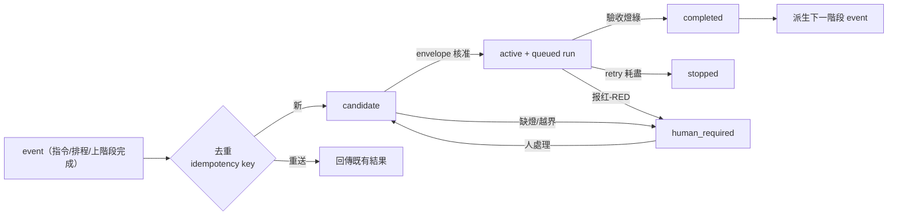
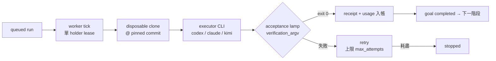

# Loop Hybrid 2 中文說明

Loop Hybrid 2（LH2）是一個**確定性 goal loop 引擎**：把核准過的目標（goal）變成可稽核的執行（run）。
每一步可重播、每個驗收來自 committed check、一切不可逆操作留在人手上。

> English: see [README.en.md](README.en.md)

## 60 秒看它閉合（self-closing proof）

不需要 credential、不需要外部服務——clone 之後：

```bash
npm test                                          # 全部確定性 gate（含完整閉環）
python3 -B lh_runtime/intent_derivation_canary.py # 指令→candidate→admission→dispatch→completed
python3 -B lh_runtime/goal_loop_canary.py         # 完整 loop：seed→執行→驗收→下一階段→重啟續跑
```

每個 canary 輸出 `{"status": "pass", ...}` 才算數；引擎不接受「模型說過了」。
這些證明全部在 tempdir 離線執行，任何 clone 此 repo 的人都能重跑同一個閉環。

## 核心概念

- **Durable SQLite goal/run store**：goal、run、attempt、用量記錄全部落庫，重啟可恢復，不存在只活在記憶體的狀態。
- **Serial 單 holder worker**：同一時間只有一個 worker 推進 loop，狀態轉移確定性、可稽核。
- **Disposable-clone executor**：每次嘗試都在一次性 workspace clone 裡執行，不污染原始碼樹。
- **Committed canary 是驗收權威**：驗收 = repo 裡的可重跑檢查（`gate-pack/`、`lh_runtime/*_canary.py`），不是模型說了算。
- **Promotion 永遠人持有**：push、merge、publish 不由 loop 執行。
- **多模型分層**：contract 的 `models` 欄位讓執行用 coding CLI、判斷用推理 CLI，彼此獨立、可各自計價。

## 流程圖

### Goal 生命週期



### Run 執行（serial，一次一條）



### 多模型分層（可選）

```mermaid
flowchart TB
    subgraph 執行層
        M1[models.execute<br/>coding CLI] --> RUN[run 執行]
    end
    subgraph 判斷層（轉折點）
        M2[models.judge<br/>推理 CLI] --> P{封閉三選一<br/>select / human_required}
        P -->|合法| SEL[選定下一條 runnable]
        P -->|越集/異常| F[退回決定性選路]
    end
    RUN -.同一 store 計價.-> COST[(usage/cost<br/>按真實模型 id)]
    M2 -.-> COST
```

不設 `models.judge` 時整個 loop 走純決定性選路，行為不變。

## 安裝

需求：**Python 3.12+** 與 **Node.js**（npm script 只是 shell/Python 的薄包裝）。

```bash
git clone https://github.com/justinyu73/loop-hybrid-2.git
cd loop-hybrid-2
npm test        # 跑全部確定性 gate（必須全綠）
npm run lint    # shell 語法 + Python 編譯檢查
```

要執行真實 coding agent，需任一已登入的 CLI：`codex`、`claude` 或 `kimi`。

## 使用

### 1. 建立專案 contract

複製 [`project_runtime_contract.example.json`](project_runtime_contract.example.json) 到你的專案，填入
`project_id`、`campaign`（stage、驗收燈、允許路徑）、`source_repo`、`base_revision`、以及可選的
`models`（execute / judge / judge_model）。

### 2. Dry-run（不觸碰 provider）

```bash
python3 -B lh_runtime/goal_loop_run.py \
  --contract /path/to/project_runtime_contract.json
```

印出解析後的執行計畫，不呼叫任何模型。

### 3. 真實執行（有界）

```bash
python3 -B lh_runtime/goal_loop_run.py \
  --contract /path/to/project_runtime_contract.json \
  --executor codex --execute \
  --max-cycles 12 --max-runtime-seconds 900
```

- executor 只在 disposable clone 裡工作；輸出止步於 PR。
- 每個 attempt 產生 receipt（含 usage）；`status_snapshot_out` 指向的檔案會得到即時狀態投影。
- `runtime/loop-pause`（或 contract 的 `pause_flag`）存在即於下一個 tick 安全停止。

### 4. 驗收紀律

「完成」只由 committed canary / lamp 證明；模型輸出永不構成驗收。
驗收失敗、依賴斷裂、scope 擴張一律轉 `human_required`，由人接手。


## 接你的專案：Operator quickstart

把 LH2 接上你真實專案的完整順序（全部離線可驗證到第 4 步）：

### A. 寫 campaign（工作單位）

Contract 的 `campaign.stages[]` 每個 stage 是一個 bounded 工作單位：`goal`（must_have/must_not）、
`allowed_paths`（diff 越界即 value RED）、`acceptance_lamp`（驗收燈）、`max_attempts`、
`next_stage_id`（多 stage 自動接跑）。

**燈的四條鐵律**（寫錯等於沒有驗收）：
1. base 上必須是紅的——綠-on-base 表示工作已完成，引擎會以 precheck $0 直通，不會叫模型。
2. deterministic、環境無關——路徑用絕對或 repo 相對，不依賴 PATH 裡的特定 venv、不觸網。
3. 燈綠必須是「工作完成才成立」的正向證據，不是「沒有報錯」。
4. 驗證器自身出錯（讀不到、缺依賴）必須非零退出——錯誤不能經任何 shell 邏輯變綠。

### B. 下指令（goal 入庫）

```bash
python3 -B lh_runtime/command_ingress.py --goal-store /path/to/goals \
  --source operator --event-type manual_intent --event-id cmd-1 \
  --payload '{"campaign_id":"example-campaign","stage_id":"stage-1","intent":"..."}'
```

也可以讓 contract 的 `standing_intents` 每天自動發（daily health check 模式）。

### C. 跑 driver

```bash
python3 -B lh_runtime/goal_loop_run.py --contract project_runtime_contract.json --execute \
  --max-cycles 12 --idle-limit 2
```

鏈路：intent → admission → disposable clone 執行 → 燈 + value gate → receipt →
（多 stage 時）自動派生下一 stage。`--status-snapshot-out` 給即時狀態投影；
cron/systemd timer 定期呼叫同一指令即成常駐（每次都是有界 session，重啟可續）。

### D. 讀結果

- `platform_status.json`：runs/goals 狀態、成本、driver heartbeat 與 stale 判定。
- `runs/artifacts/<run_id>/<attempt>/`：receipt、diff、verifier 輸出、usage——完整證據鏈。
- MCP（read-only）：`python3 -B lh_runtime/mcp_server.py --run-store ... --knowledge-store ...`。

### E. 進階：draft-PR 模式

Stage 宣告 `external_verdict`（無本地燈）+ contract 的 `external_verdict.adapter`
（github_pr）：引擎把 diff 推到你 repo 的 `lh/*` branch 並開 **draft PR**（body 帶證據鏈），
再用 GitHub CI 結論推進 run。token 用 fine-grained PAT（單一 repo、Contents RW、
Pull requests RW、Actions R），放環境變數 `LH_GITHUB_TOKEN`，不進任何檔案。
**merge 永遠是人**——引擎只到 draft PR。

## License

[MIT](LICENSE) — copyright 2026 Loop Hybrid contributors.

## Security model

- **Isolation = disposable clone.** Executor presets run agent CLIs in
  full-auto mode (`--dangerously-bypass-approvals-and-sandbox` / `--yolo` /
  `--permission-mode bypassPermissions`). This is deliberate: the safety
  boundary is that every attempt runs inside a throwaway clone pinned to a
  commit — never in your working tree. Do not point the engine at a repo you
  cannot afford to have an agent touch, and keep that boundary in mind before
  feeding it untrusted content (issues, external text).
- **Promotion is always human-owned.** The loop never pushes, merges, or
  publishes; it stops at evidence (receipts, diffs, PRs opened by a human).
- **Credentials come from environment variables only** (`LH_CI_TOKEN`,
  `LH_GITHUB_TOKEN`) and are required to be absent-safe: a missing credential
  raises instead of degrading silently.
- **Acceptance is mechanical.** Only committed canaries / verification lamps
  mark work complete; model output never flips goal/run state on its own.
- **Out-of-scope diffs are rejected deterministically** — an executor that
  writes outside the campaign's `allowed_paths` routes to `human_required`.
