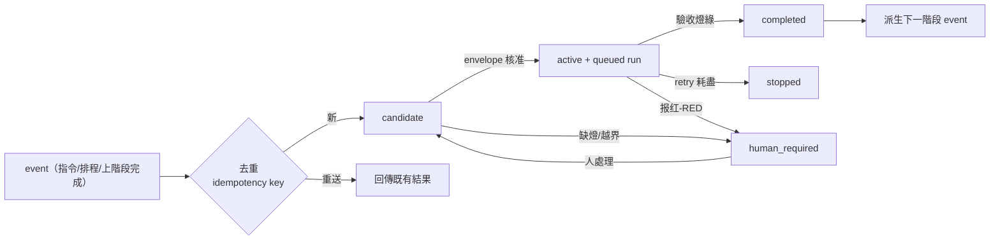
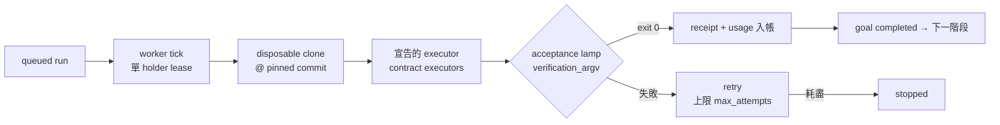

# Loop Hybrid 2 中文說明

Loop Hybrid 2（LH2）是一個**確定性 goal loop 引擎**：把核准過的目標（goal）變成可稽核的執行（run）。
每一步可重播、每個驗收來自 committed check；超出核准 Goal 權限的操作才回到人／專案。

引擎只依賴 Python 與 git。它不綁定任何模型廠商、coding CLI、IDE、終端機宿主、代管服務或作業系統服務：
會被執行的指令一律由你在 contract 裡宣告。

> English: see [README.en.md](README.en.md)

## 60 秒看它閉合（self-closing proof）

不需要 credential、不需要外部服務——clone 之後：

```bash
npm test                                          # 全部確定性 gate（含完整閉環）
python3 -B lh_runtime/intent_derivation_canary.py # 指令→candidate→admission→dispatch→completed
python3 -B lh_runtime/goal_loop_canary.py         # 完整 loop：seed→執行→驗收→下一階段→重啟續跑
```

每個 canary 輸出 `{"status": "pass", ...}` 才算數；引擎不接受「模型說過了」。
這些證明全部在 tempdir 離線執行，任何 clone 此 repo 的人都能重跑同一個閉環。

## 核心概念

- **Durable SQLite goal/run store**：goal、run、attempt、用量記錄全部落庫，重啟可恢復，不存在只活在記憶體的狀態。
- **Serial 單 holder worker**：同一時間只有一個 worker 推進 loop，狀態轉移確定性、可稽核。
- **Disposable-clone executor**：每次嘗試都在一次性 workspace clone 裡執行，不污染原始碼樹。
- **Committed canary 是驗收權威**：驗收 = repo 裡的可重跑檢查（`gate-pack/`、`lh_runtime/*_canary.py`），不是模型說了算。
- **Goal-scoped authority**：人／專案核准 Goal、權限 envelope、停止條件與終驗。引擎在 envelope 內執行、驗收、記錄；
  workspace 以外的作用（push、merge、發布）只能經由你注入的 external action port，引擎本身不附任何實作。
- **宣告式 executor**：contract 的 `executors` 宣告每個可被執行的指令（絕對路徑 argv）；`models` 只引用宣告過的名稱。
  引擎從不在 `PATH` 上搜尋 provider。
- **多模型分層**：`models.execute` 與 `models.judge` 可以指向不同的宣告；成本按你宣告的 `pricing` 計算。

## 流程圖

### Goal 生命週期


```mermaid
flowchart LR
    E["event（指令/排程/上階段完成）"] --> R{去重<br/>idempotency key}
    R -->|新| C[candidate]
    R -->|重送| O[回傳既有結果]
    C -->|envelope 核准| A[active + queued run]
    C -->|缺燈/越界| H[human_required]
    A -->|驗收燈綠| D[completed]
    A -->|retry 耗盡| S[stopped]
    A -->|报红-RED| H
    H -->|人處理| C
    D --> N[派生下一階段 event]
```

### Run 執行（serial，一次一條）


```mermaid
flowchart LR
    Q[queued run] --> W[worker tick<br/>單 holder lease]
    W --> CL[disposable clone<br/>@ pinned commit]
    CL --> X[宣告的 executor<br/>contract executors]
    X --> V{acceptance lamp<br/>verification_argv}
    V -->|exit 0| RC[receipt + usage 入帳]
    V -->|失敗| RT[retry<br/>上限 max_attempts]
    RT -->|耗盡| ST[stopped]
    RC --> N2[goal completed → 下一階段]
```

### 多模型分層（可選）

```mermaid
flowchart TB
    subgraph 執行層
        M1[models.execute<br/>宣告的 coding executor] --> RUN[run 執行]
    end
    subgraph 判斷層（轉折點）
        M2[models.judge<br/>宣告的推理 executor] --> P{封閉三選一<br/>select / human_required}
        P -->|合法| SEL[選定下一條 runnable]
        P -->|越集/異常| F[退回決定性選路]
    end
    RUN -.同一 store 計價.-> COST[(usage/cost<br/>按宣告的 pricing)]
    M2 -.-> COST
```

不設 `models.judge` 時整個 loop 走純決定性選路，行為不變。

## 本版新增的引擎能力

- **平行排程與 work-unit store**（`parallel_scheduler.py`、`work_unit_store.py`、`plan_node_controller.py`）：依賴與寫入範圍相容時，獨立 work unit 在隔離 workspace 中並行；完成依核准順序整合。
- **交付契約與完成判定**（`delivery_contract.py`、`work_unit_completion.py`、`source_result.py`）：規劃、執行、驗證共用同一個封存的契約引擎。
- **Verifier 協定**（`verifier_protocol.py`、`verifier_normalizer.py`）：verifier 結果先正規化並綁定到該次 attempt，才算數。
- **候選覆核 v2**（`delivery_contract.py`）：delivery contract 可加上 `candidate_review`（以 digest 釘住的 spec、需求與呼叫端上下文）。獨立驗證器必須回傳綁定這次候選的封閉 review，判定由引擎依 findings 推導；review 以 digest 封存，讀回時重驗。exit 0 但沒有 review 不算通過。work unit 路徑上，相關 checks 先跑；RED review 的 finding 回饋給下一次 attempt，次數受 attempt 上限約束；不阻擋的建議只寫入 discovery，不會自動成為任務。
- **正常接續**（`task_area.py`）：採用候選覆核 v2 的任務，在前一個任務的整合收據鏈經重驗通過後，依規則放行已核准的後繼，不呼叫 Planner；RED、未結的修復請求與舊任務仍交給原本的 Planner port。
- **宣告式 executor**（`cli_agent_executor.py`）：executor 宣告是封閉的資料，不是程式碼；未宣告的名稱一律拒絕。
- **Execution fence port**（`execution_fence.py`、`execution_fence_local.py`）：每次啟動都先準備一次性、綁 digest 的 launch descriptor。
  引擎附的 `local-process` backend 管理程序群組、逾時與輸出上限，並在 receipt 如實寫出「沒有隔離」；
  真正的隔離 backend 由你以 port 提供。沒有選 backend 時預設停用，run 停在 `human_required`，不會無 fence 執行。
- **Platform ports**（`platform_ports.py`、`host_ports.py`、`instance_config.py`、`lifecycle.py`）：鎖、路徑、程序控制等主機差異集中在 port，核心不含固定主機路徑。
- **Provider registry 與輸入綁定**（`provider_registry.py`、`provider_input_binding.py`、`runner_adapter.py`）：依 capability 選路，專案節點不指定 provider／model。
- **決策登記**（`gate-pack/decision_registry/`，給目標 repo 用的工具）：決策在工作開始前登記，必須附驗收探針與允許改動的路徑；用 git 逐 commit 找出碰到受保護路徑卻沒引用已登記決策的改動；結果每次重跑探針推導，不儲存「已完成」。
- **進度收據與驗證佇列**（`gate-pack/progress_receipts/`，給目標 repo 用的工具）：請求方只能指名檢查 id，由驗證方在釘住 HEAD 的快照中執行並寫入雜湊鏈收據；沒有收據的進度不算進度。驗證、驗收、推廣分開記錄且有先後；兩個角色是否真的是不同身分，由工具量測並如實回報。
- **推進判定**（`gate-pack/advancement/`，給目標 repo 用的工具）：評估前就固定每個判準的 baseline 與 closing 收據，只有「原本紅、後來綠」才算推進；已經綠的檢查、worker 自選的檢查都不算。
- **獨立的重試驗證器**（`gate-pack/retry_verifier/`）：另一份不 import 引擎模組的實作，以唯讀方式讀 work-unit store 與 executor 的 digest 綁定收據，核對重試鏈與啟動上限是否一致。
- **一次性 clone 的 push 邊界**（`controller.py`）：clone 的 remote 一律封閉 push 並裝上拒絕的 `pre-push` hook；executor 前後比對原始 repo 的 refs，被改動就轉為 `human_required`。
- **待人處理事項**（`open_questions.py`）：快照中的 `open_questions` 把每個 `human_required` 的 Goal 與事件標上類型、原因與等待時間，久未處理的標為 `quiet`。
- **保存與工作區衛生**（`retention.py`）：預設只產生計畫（`lh-retention-plan/v1`），加上 `--apply` 才刪除。只刪引擎自己產生、已被取代且未被參照的暫存（驗證快照、啟動暫存、失敗診斷、修復副本、review proof）；被 store 或 JSON 證據引用的、寬限期內的、每類最新的一筆、repository 根目錄與任何 symlink／junction 一律保留並寫明原因，store 之外不碰。
- **狀態可信度**（`status_lamp.py`、`status_snapshot.py`）：heartbeat 與快照帶 `code_identity`，磁碟上的引擎已更新而 driver 沒重啟時標為 stale（只回報，不自動重啟）；快照的 `lamp` 是唯一的健康判定，由純函式依固定規則產生並附上觸發的規則。
- **多專案排程**（`fleet.py`）：外部排程器每次喚醒時，依登記表（`lh-fleet-registry/v1`）讓每個 `enabled` 專案各跑一次有界的 `goal_loop_run` session，各自保有 contract、store、lock 與 receipt；一個專案失敗不阻擋其他專案，`paused` 不被喚醒，已被持有的專案回報 `not_holder`。
- **專案上手**（`onboarding.py`）：`init` 寫入 contract 與驗收燈範本（不覆寫既有檔案）；`validate` 只讀檔案與 git 物件，回報形狀錯誤與漂移（例如驗證器落在 `allowed_paths` 內、executor 不是絕對路徑）；`pilot` 把目標 clone 到暫存目錄，以宣告的替身 executor 經真實入口跑一次完整的 run 到 verified，目標 repo 前後不變。
- **固定選路表**（`failure_router.py`）：失敗後「下一步由誰做什麼」由一張封閉的代碼表決定，不呼叫模型，收據可重算。只有十項擁有者動作需要人；未知代碼路由到選路表本身，同一處失敗達 3 次改走唯讀稽核。目前是投影：待人處理事項會標出「其實機器可處理」的項目，不改變執行流程。
- **計畫形狀檢查**（`plan_shape.py`）：宣告 `lh-sealed-plan/v1` 的計畫，在交給驗證器之前先由引擎以固定清單檢查（循環、重複、佔位符、未知依賴與可派工節點、平行群組的路徑衝突與互相依賴），有缺陷就附代碼拒絕，驗證器不會被呼叫。
- **planner recovery 行為考卷**（`planner_recovery_canary.py`）：方案與判定的驗證規則逐條驗證；campaign 路徑在審核通過後一律停在等待授權，不自行套用、不補 attempt 上限，角色失敗不重試，重啟不重呼叫。
- **正式根目錄防護**（`platform_ports.py`）：任務與測試的狀態、暫存目錄，一律不得位於引擎依平台路徑規則得到的正式根目錄內；任務暫存改名為 `LH_TASK_STATE_ROOT`／`LH_TASK_TMP_ROOT`，設定舊名稱時明確拒絕並指出新名稱。
- **考卷盤點**（`canary_inventory_canary.py`）：`lh_runtime/` 的每一支 canary 都必須由 `verify.sh` 執行，或列在附理由的豁免表中，避免考卷沒人執行而靜靜壞掉。
- **work-unit recovery 生命週期考卷**（`work_unit_recovery_canary.py`）：在走完真實完成流程的 Run 上驗證 recovery store API：身分綁定、以 Run 計的呼叫預算、套用前重驗與各動作的落點，以及連續 3 次失敗時引擎要求先做唯讀稽核。

## 平台支援

| 平台 | 狀態 |
|---|---|
| Linux | 參考平台；CI（`ubuntu-latest`）跑全部 gate。 |
| Windows（原生 Python 3.12 + Git for Windows `sh`） | 部分支援：103 個 gate 中 95 個通過（請設定 `PYTHONUTF8=1`）。8 個失敗，都依賴 POSIX 行為或固定計時：POSIX 檔案權限與 symlink 權限（2）、POSIX signal／程序 holder 語義（2）、POSIX 路徑或平台預設（2），以及計時預算（2）——run verdict 有固定 0.25 秒預算，attempt timeout 在主機負載高時會超出預算；Windows 程序啟動較慢時兩者都會超時。沒有設定 `PYTHONUTF8=1` 時，cp950 等非 UTF-8 主控台上的 `ceremony` 可能因讀不了中文 commit 訊息而失敗。 |
| macOS | 未測試。 |

## 宣告 executor

引擎會執行的每個模型指令，都必須在 contract 的 `executors` 區塊宣告：

```json
"executors": {
  "coder": {"argv": ["/absolute/path/to/your-coding-agent", "{prompt}"], "usage": "none"},
  "judge": {"argv": ["/absolute/path/to/your-reasoning-agent", "--model", "{model}", "{prompt}"],
            "usage": "lh-usage-line/v1"}
},
"models": {"execute": "coder", "judge": "judge", "judge_model": "your-model-id"}
```

- `argv[0]` 必須是絕對路徑；`{prompt}` 恰好出現一次。引擎從不在 `PATH` 上找 provider，所以機器上裝了什麼 CLI 都不會被意外叫到。
- `{model}`、`{base_url}` 是可選的插槽：有插槽就必須有值（`judge_model` 或 `models.execute_binding`），有值也必須有插槽，否則拒絕。
- `usage` 只有兩種：`none`（用量記為 unknown），或 `lh-usage-line/v1`——executor 在 stdout 最後一行印出
  `{"usage": {"input_tokens": 0, "output_tokens": 0, "cache_read_tokens": 0}}`。引擎不解析任何廠商的輸出格式，也不猜數字。
- 非零退出就是該次 attempt 失敗。
- `pricing`（可選）以「每百萬 token 美元」宣告各 model 的費率：`{"your-model-id": {"input": 1.0, "output": 4.0, "cache_read": 0.1}}`。
  沒有宣告的 model 成本為 unknown；引擎不內建任何價目表。每日成本上限只會用你宣告的費率。
- 不帶 contract 時，可以用 `--executors <file.json>` 傳入同樣格式的宣告。

## 安裝

需求：**Python 3.12+**、**git** 與 **Node.js**（npm script 只是 shell/Python 的薄包裝）。

```bash
git clone https://github.com/justinyu73/loop-hybrid-2.git
cd loop-hybrid-2
npm test        # 跑全部確定性 gate（必須全綠）
npm run lint    # shell 語法 + Python 編譯檢查
```

要讓真實 coding agent 工作，在 contract 的 `executors` 宣告它的絕對路徑即可；引擎不要求任何特定工具。

## 使用

### 1. 建立專案 contract

最快的方式是讓引擎寫出範本，先檢查，再用替身 executor 試跑一次（不呼叫任何模型，也不改動你的 repo）：

```bash
python3 -B lh_runtime/onboarding.py init /path/to/your-repo        # 寫入 project_runtime_contract.json 與 checks/acceptance.py
python3 -B lh_runtime/onboarding.py validate /path/to/your-repo    # 回報形狀錯誤與漂移；不執行 repo 中的任何東西
python3 -B lh_runtime/onboarding.py pilot /path/to/your-repo \
  --executors stand-in.json --executor stand-in                   # 在暫存 clone 中跑一次完整的 run
```

pilot 讀的是 repo 的已 commit 內容，所以驗收燈要先 commit。也可以手動
複製 [`project_runtime_contract.example.json`](project_runtime_contract.example.json) 到你的專案，填入
`project_id`、`campaign`（stage、驗收燈、允許路徑）、`source_repo`、`base_revision`、`executors`、
`models`（execute，可選 judge / judge_model），以及可選的 `pricing`。

### 2. Dry-run（不觸碰 provider）

```bash
python3 -B lh_runtime/goal_loop_run.py \
  --contract /path/to/project_runtime_contract.json
```

印出解析後的執行計畫，不呼叫任何模型。

### 3. 真實執行（有界）

```bash
export LH_EXECUTION_FENCE_BACKEND=local-process
python3 -B lh_runtime/goal_loop_run.py \
  --contract /path/to/project_runtime_contract.json \
  --execute --max-cycles 12 --max-runtime-seconds 900
```

- executor 只在 disposable clone 裡工作；引擎不會把結果推到任何地方。
- 每個 attempt 產生 receipt（含 usage）；`status_snapshot_out` 指向的檔案會得到即時狀態投影。
- `runtime/loop-pause`（或 contract 的 `pause_flag`）存在即於下一個 tick 安全停止。

> **delivery 綁定與執行（必讀）**：引擎要求每個 run 都有 delivery 綁定，而且 executor、delivery 檢查與獨立驗證器都必須經過 execution fence 執行。
>
> - **啟用**：在 stage 加上 `"delivery": {"derive": "acceptance_lamp"}`（見範例 contract）。載入 contract 時，會用該 stage 的驗收燈編出封存綁定：planner 標為 `operator-contract`，並綁定 contract 檔的 digest。可以用 `"checks": [{"id": "...", "argv": [...]}]` 指定 delivery 檢查，預設為 `git diff --cached --check`。
> - **執行**：`--execute` 時，每個指令經 `LH_EXECUTION_FENCE_BACKEND` 指定的 fence 執行。`local-process` 在 clone 內以獨立程序群組執行、逾時會終止整個群組，並在 receipt 標示 `kernel_containment: false`——它不提供隔離，安全邊界仍是 disposable clone。需要隔離時，實作 `ExecutionFencePort` 並以你的 backend 取代它。
> - **沒有選 backend 時**：不安裝執行器，run 停在 `human_required`，原因寫在輸出的 `plan.delivery_command_runner`。
> - 沒有 `delivery` 欄位的 stage 仍停在 `planning_required`；native-run 綁定（`planner_recovery`）不受影響。

### 4. 驗收紀律

「完成」只由 committed canary / lamp 證明；模型輸出永不構成驗收。
驗收失敗、依賴斷裂、scope 擴張一律轉 `human_required`，由人接手。


## 接你的專案：Operator quickstart

把 LH2 接上你真實專案的完整順序（全部離線可驗證到第 4 步）：

### A. 寫 campaign（工作單位）

Contract 的 `campaign.stages[]` 每個 stage 是一個 bounded 工作單位：`goal`（must_have/must_not）、
`allowed_paths`（diff 越界即 value RED）、`acceptance_lamp`（驗收燈）、`max_attempts`、
`next_stage_id`（多 stage 自動接跑）。

**燈的五條鐵律**（寫錯等於沒有驗收）：
1. base 上必須是紅的——綠-on-base 表示工作已完成，引擎會以 precheck $0 直通，不會叫模型。
2. deterministic、環境無關——路徑用絕對或 repo 相對，不依賴 PATH 裡的特定 venv、不觸網。
3. 燈綠必須是「工作完成才成立」的正向證據，不是「沒有報錯」。
4. 驗證器自身出錯（讀不到、缺依賴）必須非零退出——錯誤不能經任何 shell 邏輯變綠。
5. 驗證器必須在 `allowed_paths` 之外——否則 agent 可以改掉驗證器讓燈變綠。啟用 delivery 的 stage 若違反，載入 contract 時就會被拒絕（`independent_verifier_in_write_scope`）。

### B. 下指令（goal 入庫）

```bash
python3 -B lh_runtime/command_ingress.py --goal-store /path/to/goals \
  --source operator --event-type manual_intent --event-id cmd-1 \
  --payload '{"campaign_id":"example-campaign","stage_id":"feature","intent":"..."}'
```

也可以讓 contract 的 `standing_intents` 每天自動發（daily health check 模式）。

### C. 跑 driver

```bash
LH_EXECUTION_FENCE_BACKEND=local-process \
python3 -B lh_runtime/goal_loop_run.py --contract project_runtime_contract.json --execute \
  --max-cycles 12 --idle-limit 2
```

鏈路：intent → admission → disposable clone 執行 → 燈 + value gate → receipt →
（多 stage 時）自動派生下一 stage。前提是 stage 已啟用 delivery，見「使用」第 3 節。`--status-snapshot-out` 給即時狀態投影；
任何外部排程器定期呼叫同一指令即成常駐（每次都是有界 session，重啟可續）。

### D. 讀結果

- `platform_status.json`：runs/goals 狀態、成本、driver heartbeat 與 stale 判定。
- `runs/artifacts/<run_id>/<attempt>/`：receipt、diff、verifier 輸出、usage——完整證據鏈。
- MCP（read-only）：`python3 -B lh_runtime/mcp_server.py --run-store ... --knowledge-store ...`。

### E. 進階：外部作用與外部判定

引擎不附任何外部服務的 adapter。要讓 loop 在 workspace 以外產生作用（push、開 review、merge、發布），
或以外部系統的結論推進 run，請透過引擎 API 注入：

- **external action port**（`external_action_port.py`）：以 `operation_key` 去重的介面與本地 ledger；
  你的 adapter 必須對同一個 key 讀回既有效果，才能保證重試不重複作用。
- **verdict store 與 conclusion source**（`external_verdict.py`）：外部結論只接受明確的 `success` / `failure`，
  來源或憑證錯誤不會變成重試判定。
- **effect guard**（`effect_guard.py`）：run 完成後的作用（merge、發布、部署）經 `guarded_dispatch` 送出時，引擎會先確認目前 attempt 的最終交付為 GREEN、diff 沒碰到 authority surface、外部目標讀回仍是審過的那一份（等待之後再讀一次）；帶候選覆核 v2 的 contract 還需要綁定 contract digest 的 `lh-effect-grant/v1`。送出前先記錄 prepared，回應遺失時只讀回確認，絕不重送。你的 target 只需實作 `readback` 與以 `op_key` 去重的 `perform`。

contract 裡帶 `external_verdict` 區塊會被明確拒絕，不會靜默忽略。是否允許外部作用，由注入方的授權決定；
公開發布、release 與產品終驗仍由人／專案持有。

## License

[MIT](LICENSE) — copyright 2026 Loop Hybrid contributors.

## Security model

- **Isolation is the disposable clone.** Every attempt runs in a throwaway
  clone pinned to a commit, never in your working tree. The bundled
  `local-process` fence bounds time, output, and the process group but contains
  nothing, and its receipts say so (`kernel_containment: false`). The flags in
  your executor declaration decide how much autonomy the agent gets. Do not
  point the engine at a repo you cannot afford to have an agent touch, and keep
  that boundary in mind before feeding it untrusted content.
- **Only declared commands run.** Executors are absolute-path argv
  declarations; the engine never searches `PATH` for a provider, and an
  undeclared name is refused.
- **Authority is goal-scoped.** The engine ships no push, merge, or publish
  adapter. Effects outside the workspace go through an injected external action
  port that the project authorizes. Publication, release, and terminal product
  acceptance remain project/human-owned.
- **Credentials come from environment variables only** (for example
  `LH_CI_TOKEN` for an injected conclusion source) and are required to be
  absent-safe: a missing credential raises instead of degrading silently.
- **Acceptance is mechanical.** Only committed canaries / verification lamps
  mark work complete; model output never flips goal/run state on its own.
- **Costs are never invented.** Unmeasured usage or an unpriced model stays
  `unknown`; the engine ships no price table.
- **Out-of-scope diffs are rejected deterministically** — an executor that
  writes outside the campaign's `allowed_paths` routes to `human_required`.
